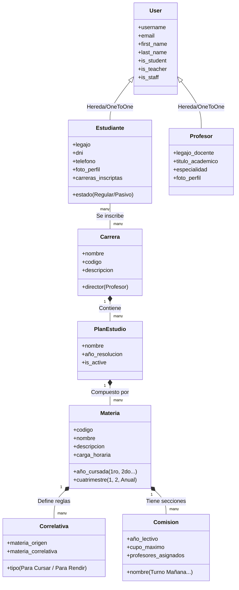

# Plan de Arquitectura y Estructura - Campus Virtual (SIU Guaraní)

Este documento detalla la propuesta técnica y organizativa para el desarrollo del Campus Virtual del IES 9-007 "Salvador Calafat". Está diseñado bajo los principios de **Arquitectura Limpia** (Clean Architecture) de Robert C. Martin (Uncle Bob) y los principios **SOLID**, adaptados al funcionamiento nativo de **Django** y **Python**.

---

## 1. Recomendaciones Tecnológicas

Para lograr una plataforma robusta, moderna y mantenible, analizamos las opciones de bases de datos y la interfaz visual:

### 1.1 Base de Datos: ¿SQLite o MySQL / PostgreSQL?
* **SQLite (Recomendado para Desarrollo e Investigación)**:
  * **Pros**: No requiere configuración, se almacena en un solo archivo local (`db.sqlite3`), ideal para que el equipo trabaje de forma ágil y para realizar pruebas unitarias rápidas.
  * **Contras**: Bloquea la base de datos completa durante escrituras concurrentes (`database is locked`). No sirve para producción con múltiples usuarios activos (estudiantes inscribiéndose al mismo tiempo).
* **PostgreSQL o MySQL (Recomendado para Producción y Presentación Final)**:
  * **Pros**: Soportan alta concurrencia de lectura/escritura, transacciones seguras (ACID), integridad referencial estricta y búsquedas optimizadas. Django tiene un soporte excepcional para PostgreSQL.
  * **Contras**: Requieren instalación y configuración de un servidor de base de datos.
* **Vedicto**: **Desarrollen localmente con SQLite** para no perder tiempo configurando servidores en cada máquina. Al momento de desplegar para la presentación final o pruebas de stress, configuren **PostgreSQL** mediante variables de entorno en Django (`settings.py`).

### 1.2 Frontend: ¿Django Templates nativo o Framework SPA (React/Vue)?
* **Framework SPA (React/Vue/Angular)**:
  * **Pros**: Experiencia de usuario muy fluida, desacoplamiento absoluto de capas.
  * **Contras**: Requiere construir una API REST completa (con Django REST Framework), duplicar esquemas de validación, manejar CORS, tokens JWT y gestionar dos proyectos separados. Aumenta la complejidad exponencialmente.
* **Django Templates + Tailwind CSS + HTMX (Recomendación Estrella) ⭐**:
  * **¿Qué es HTMX?**: Es una librería de JavaScript ultra liviana que permite realizar peticiones AJAX directamente desde atributos HTML (`hx-get`, `hx-post`, `hx-target`), actualizando partes de la pantalla sin recargar la página.
  * **Pros**: Mantienen la simplicidad del flujo de Django (MVT), pero con la interactividad de una SPA (ej. buscar materias en tiempo real, inscribirse con un click sin recargar la página, cargar modales).
  * **Alineación**: Cumple al 100% con la exigencia de la facultad de usar Django, permitiendo un diseño visual premium y dinámico mediante **Tailwind CSS** (para estilos modernos y responsivos) y **Google Fonts** (Inter u Outfit).

---

## 2. Análisis y Modelado del Dominio (Negocio)

Para evitar un diseño monolítico y bases de datos acopladas, organizamos el dominio en modelos de negocio con responsabilidades únicas.

### 2.1 Módulos / Apps de Django Sugeridos
En Django, la mejor forma de aplicar SRP (Single Responsibility Principle) a nivel macro es separando el proyecto en **aplicaciones pequeñas y cohesivas**:
1. `authentication`: Gestión de usuarios (Custom User), perfiles y autenticación.
2. `carreras`: Gestión de Carreras, Planes de Estudio e Integridad de Correlativas.
3. `materias`: Gestión de asignaturas, contenidos y asignaciones docentes.
4. `academico`: Inscripciones a cursadas, actas de examen, notas y regularidades.
5. `mesas`: Gestión de mesas de examen final y mesas de consulta.
6. `tramites`: Solicitudes de alumnos (certificados, analíticos en trámite).

---

### 2.2 Refinamiento de Entidades y Modelos



#### A. Gestión de Carreras, Planes y Materias
* **Carrera**: Almacena el nombre, código interno, descripción y un campo `director` (relación a `Profesor`).
* **PlanEstudio**: Una Carrera puede cambiar de plan a lo largo de los años. Este modelo agrupa las materias para un año de resolución específico (ej. "Plan de Desarrollo de Software 2024").
* **Materia**: Contiene nombre, descripción, alcance (programa) y la ubicación en el plan (año de cursada y cuatrimestre).
* **Correlativas**: Para modelar esto limpiamente, se usa una relación autoreferenciada (`ManyToManyField` hacia sí misma) mediante una tabla intermedia `MateriaCorrelativa`. Debe diferenciar entre:
  * **Correlativa para cursar**: Requiere tener la materia previa regularizada (o aprobada).
  * **Correlativa para rendir**: Requiere tener la materia previa aprobada.

#### B. Gestión de Estudiantes y Profesores
* **Usuarios**: Django provee un sistema de autenticación excelente. Se recomienda extender la clase `AbstractUser` de Django para centralizar credenciales (email, contraseña, roles básicos como `es_estudiante`, `es_profesor`, `es_administrativo`).
* **Estudiante**: Relación `OneToOne` con el usuario personalizado. Contiene legajo único, DNI, teléfono, foto de perfil y estado académico.
* **Profesor**: Relación `OneToOne` con el usuario personalizado. Contiene legajo docente, títulos académicos y áreas de especialización.
* **Cargos y Designaciones**: Para modelar cargos como "Director de Carrera", "Director de Tesis" o "Investigador", se crea un modelo `CargoDocente` para registrar en qué carrera y bajo qué resolución posee ese cargo el profesor, respetando el principio de diseño abierto a extensión.

#### C. Gestión de Clases y Cursadas (Comisiones)
* Una **Materia** es abstracta, pero se materializa cada año en una **Comisión** (ej: "1° Año Desarrollo de Software - Comisión A - Turno Noche - Ciclo Lectivo 2026").
* La comisión almacena las fechas de los exámenes parciales, horarios de cursada, cupos y la lista de profesores asignados a esa sección específica.
* Los estudiantes se inscriben a **Comisiones**, no a materias abstractas.

#### D. Mesas de Examen y Consulta
* **MesaExamen**: Contiene la fecha, hora, aula, tipo de llamado (ej: Julio/Agosto), y el Tribunal Examinador (Presidente, Vocal 1, Vocal 2, todos FK a Profesor).
* **InscripcionMesa**: Tabla intermedia que asocia al Estudiante con la Mesa de Examen y registra la nota final obtenida y la condición (libre o regular).
* **MesaConsulta**: Horarios semanales de los profesores donde los estudiantes se inscriben para resolver dudas previas a rendir.

#### E. Rol Administrativo (Secretaría/Directivo)
El personal administrativo actúa como el orquestador del sistema. Sus responsabilidades y casos de uso principales son:
* **Gestión de Fechas Académicas (Calendario)**: Habilitar y deshabilitar periodos de inscripción a cursadas y periodos de inscripción a finales.
* **Validación de Regularidades**: Modificar o auditar estados de regularidad de alumnos en actas de materias.
* **Actas de Examen**: Generar y cerrar actas de examen finales (documento legal e inmutable una vez firmado digitalmente por los profesores).
* **Emisión de Trámites**: Aprobar solicitudes de certificados de alumno regular y analíticos parciales generándolos en PDF.

---

## 3. Arquitectura Limpia aplicada a Django (SOLID)

El flujo por defecto de Django empuja a escribir lógica de negocios en las vistas (`views.py`) o dentro del ORM (`models.py`). Esto rompe el Principio de Responsabilidad Única (SRP). 

Para implementar una **Arquitectura Limpia**, adaptaremos la estructura separando las responsabilidades en capas claras:

```
┌────────────────────────────────────────────────────────────────────────┐
│                              CAPA DE PRESENTACIÓN                      │
│     (Django Views, Templates HTML, HTMX, Django Forms/Serializers)     │
└───────────────────────────────────┬────────────────────────────────────┘
                                    │ Usa
                                    ▼
┌────────────────────────────────────────────────────────────────────────┐
│                              CAPA DE SERVICIOS                         │
│               (Casos de Uso del Negocio - Python Puro)                │
│    Ej: Validar correlativas, inscribir estudiante, emitir certificado  │
└───────────────────────────────────┬────────────────────────────────────┘
                                    │ Interactúa con
                                    ▼
┌────────────────────────────────────────────────────────────────────────┐
│                            CAPA DE DATOS Y DOMINIO                     │
│                (Django ORM Models, Manejo de Base de Datos)            │
└────────────────────────────────────────────────────────────────────────┘
```

### Principios Aplicados:
* **Single Responsibility Principle (SRP)**: Cada archivo maneja un solo concepto o flujo. Por ejemplo, en lugar de un archivo `models.py` gigante, se crea una carpeta `models/` con archivos individuales.
* **Service Layer (Capa de Casos de Uso)**: Toda lógica de validación e inscripción ocurre en archivos de la carpeta `services/`. Las vistas de Django solo reciben la petición del usuario, invocan al servicio correspondiente y devuelven el HTML/JSON. Las vistas no deciden si un alumno cumple con las correlativas; eso lo decide el servicio.
* **Repository Pattern (Opcional en Django)**: Dado que Django ORM es sumamente potente, escribir repositorios puros añade demasiado código repetitivo. En su lugar, utilizaremos los **Custom Managers** de Django (`models.Manager`) para encapsular las consultas complejas a la base de datos (QuerySets), manteniendo los modelos del ORM limpios de lógica de filtrado compleja.

---

## 4. Estructura de Directorios del Proyecto

A continuación se presenta el árbol de directorios recomendado. En él se observa cómo fragmentar cada app de Django para lograr archivos de responsabilidad única:

```
proyecto_campus_virtual/         # Carpeta raíz del repositorio git
│
├── manage.py                     # Script de administración de Django
├── db.sqlite3                    # Base de datos local (desarrollo)
│
├── config/                       # Carpeta de configuración del proyecto (antes de renombrar "proyecto")
│   ├── __init__.py
│   ├── settings.py               # Configuración global, apps registradas y DB
│   ├── urls.py                   # Enrutamiento principal del sistema
│   ├── asgi.py
│   └── wsgi.py
│
├── apps/                         # Directorio contenedor para modularizar el proyecto
│   ├── __init__.py
│   │
│   ├── authentication/           # App para control de usuarios y perfiles
│   │   ├── __init__.py
│   │   ├── apps.py
│   │   ├── admin.py
│   │   ├── models/               # Carpeta para modelos (SRP)
│   │   │   ├── __init__.py
│   │   │   ├── usuario.py        # Custom User (AbstractUser)
│   │   │   ├── estudiante.py     # Perfil Estudiante (OneToOne)
│   │   │   └── profesor.py       # Perfil Profesor (OneToOne)
│   │   ├── views/                # Carpeta para controladores
│   │   │   ├── __init__.py
│   │   │   ├── login.py
│   │   │   └── registro.py
│   │   └── forms/                # Formularios de validación de UI
│   │       ├── __init__.py
│   │       └── auth_forms.py
│   │
│   ├── carreras/                 # App para gestión estructural de carreras
│   │   ├── __init__.py
│   │   ├── apps.py
│   │   ├── admin.py
│   │   ├── models/
│   │   │   ├── __init__.py
│   │   │   ├── carrera.py        # Modelo Carrera
│   │   │   ├── plan_estudio.py   # Modelo Plan de Estudio
│   │   │   └── cargo_docente.py  # Cargos especiales en carreras
│   │   ├── services/             # Casos de uso de carreras
│   │   │   ├── __init__.py
│   │   │   └── carrera_service.py
│   │   └── views/
│   │       ├── __init__.py
│   │       └── carrera_views.py
│   │
│   ├── materias/                 # App para gestión académica de asignaturas
│   │   ├── __init__.py
│   │   ├── apps.py
│   │   ├── models/
│   │   │   ├── __init__.py
│   │   │   ├── materia.py        # Modelo Materia básica
│   │   │   ├── correlativa.py    # Modelo de relaciones correlativas
│   │   │   ├── contenido.py      # Ejes temáticos y alcance
│   │   │   └── comision.py       # Secciones anuales de materias
│   │   └── views/
│   │       ├── __init__.py
│   │       └── materia_views.py
│   │
│   └── academico/                # App transaccional (Inscripciones, Notas)
│       ├── __init__.py
│       ├── apps.py
│       ├── models/
│       │   ├── __init__.py
│       │   ├── inscripcion.py    # Registro de estudiante cursando comision
│       │   └── regularidad.py    # Condición final en cursada
│       ├── managers/             # Consultas complejas de BD (QuerySets)
│       │   ├── __init__.py
│       │   └── inscripcion_manager.py
│       ├── services/             # LÓGICA CORE (Reglas SIU Guaraní)
│       │   ├── __init__.py
│       │   # Validador de correlativas e inscripción de alumnos (Caso de uso clave)
│       │   └── inscripcion_service.py 
│       └── views/
│           ├── __init__.py
│           ├── inscripciones.py
│           └── actas_examen.py
│
├── templates/                    # Plantillas HTML globales
│   ├── base.html                 # Estructura HTML5 base (Tailwind, Google Fonts y HTMX)
│   ├── components/               # Componentes UI reutilizables (navbar, sidebars, alerts)
│   ├── authentication/           # Templates de autenticación
│   ├── carreras/
│   └── academico/
│
└── static/                       # Archivos estáticos de desarrollo (CSS, JS, imágenes)
    ├── css/
    │   └── styles.css            # Archivo CSS con estilos personalizados y Tailwind
    └── js/
        └── main.js
```

---

## 5. Explicación de la Organización de Archivos (Clave para su Trabajo)

Para implementar el flujo correctamente de forma "archivo por archivo", sigan las siguientes pautas organizativas:

### 5.1 Cómo segmentar carpetas en Django (`__init__.py`)
Cuando reemplazan un archivo como `models.py` por una carpeta `models/`, Django necesita poder descubrirlos. Para ello, en el archivo `__init__.py` dentro de esa carpeta, deben importar los modelos para exponerlos al ORM.
*Ejemplo conceptual para `apps/authentication/models/__init__.py`:*
```python
# Este archivo le dice a Django qué clases exportar del paquete
from .usuario import Usuario
from .estudiante import Estudiante
from .profesor import Profesor
```
*Lo mismo aplica para vistas (`views/`), formularios (`forms/`) y servicios (`services/`).*

### 5.2 El rol de la Capa de Servicios (`services/`)
Esta es la gema de la **Arquitectura Limpia**. Consideren la acción: *"El estudiante se inscribe a una materia"*.
* **La Vista (`views.py`)**: Recibe la petición HTTP POST de la inscripción. Toma los IDs del estudiante y de la comisión. Llama al servicio de inscripción. Si el servicio es exitoso, renderiza un mensaje verde de éxito (con HTMX); si falla, atrapa la excepción y retorna un mensaje rojo. No calcula nada.
* **El Servicio (`inscripcion_service.py`)**: Es una clase o conjunto de funciones puras en Python. Contiene la lógica de negocio:
  1. Verifica si el estudiante está activo.
  2. Consulta si la comisión tiene cupo libre.
  3. Ejecuta la lógica para verificar si cumple las correlativas requeridas (llamando al modelo o managers de correlativas).
  4. Si cumple todo, crea el registro en el modelo `Inscripcion` y descuenta una vacante.
  5. Si algo falla, lanza excepciones personalizadas (ej. `CorrelativasNoCumplidasException`).

Esta separación les permitirá testear unitariamente la lógica académica (las correlativas, los promedios) de forma sumamente sencilla sin levantar un navegador ni depender de peticiones HTTP de Django.

---

## 6. Flujo de Trabajo y Pasos Recomendados para Iniciar

Recomendamos que trabajen en este orden secuencial para ir construyendo cimientos sólidos antes de pasar a la interfaz visual:

1. **Configuración Inicial del Proyecto**:
   * Crear el entorno virtual de Python.
   * Inicializar el proyecto Django y crear la carpeta `apps/` para albergar sus aplicaciones modularizadas.
   * Crear la app de `authentication` e implementar el custom User model (hagan esto antes de correr su primera migración, es fundamental en Django).
2. **Definición de Modelos Estructurales (Base de Datos)**:
   * Crear las carpetas `models/` en cada app e ir definiendo las clases correspondientes (Carrera, PlanEstudio, Materia, Correlativa).
   * Generar y correr las migraciones preliminares para verificar la estructura de base de datos en SQLite.
3. **Desarrollo de la Capa de Servicios**:
   * Implementar las funciones de lógica de negocio (Inscripciones a cursadas y validación de correlatividades) dentro de sus respectivos `services/`.
   * Escribir pruebas unitarias (`tests.py`) para asegurar que estas reglas de negocio funcionen de manera perfecta antes de diseñar pantallas.
4. **Capa de Presentación (Vistas y Plantillas)**:
   * Diseñar el sistema visual moderno usando `base.html` con Tailwind CSS importado y cargando HTMX en el header.
   * Construir el Dashboard principal del alumno (visualización de plan de estudio, materias actuales) y del administrativo (aprobación de trámites, mesas).
   * Integrar HTMX para dotar de dinamismo y velocidad a la plataforma.
